# 🏘️ Neighbour — Local Services Marketplace

> A full-stack marketplace that connects people in **Khulna, Bangladesh** with trusted, verified local service professionals — plumbers, cleaners, photographers, handymen, tutors and more.

Clients discover and book services; professionals manage their offerings, availability and bookings; and an admin oversees approvals, users and platform revenue (a **15% commission** on every completed service).

**Tech stack:** React 19 + TypeScript + Vite · Tailwind CSS · PHP 8.2 (Apache) REST API · MySQL 8 · Docker

---

## 📑 Table of Contents

- [Features](#-features)
- [Architecture](#-architecture)
- [Tech Stack](#-tech-stack)
- [Screenshots](#-screenshots)
- [Project Structure](#-project-structure)
- [Getting Started](#-getting-started)
- [Demo Accounts](#-demo-accounts)
- [Data Model](#-data-model)
- [API Reference](#-api-reference)
- [Database Notes](#-database-notes)
- [Troubleshooting](#-troubleshooting)
- [Roadmap](#-roadmap--future-work)

---

## ✨ Features

### 👤 Client
- Email/password sign-up & login (bcrypt-hashed, session-based)
- Browse **Services** and a **Professionals** directory with search, category / area / rating filters, and sorting
- View rich professional profiles — bio, ratings, reviews, tags, weekly availability
- **Book a service** for a specific date & time slot (with double-booking prevention)
- Track bookings (**My Bookings**) and cancel if needed
- Leave **reviews** (only after a booking is completed) — provider ratings recompute automatically
- **Save professionals to Favourites** and revisit them any time
- **Message** professionals directly (in-app chat)

### 🛠️ Service Provider
- Sign up with a **National ID card number** → account stays **pending until an admin approves it**
- Personal **dashboard**: at-a-glance stats (active services, bookings, pending requests, earnings)
- Full **service management** (create / edit / delete, with image upload)
- **Set weekly availability** (per-day open/closed + working hours) — this drives the client booking slots
- Manage incoming bookings — **Confirm / In Progress / Complete / Cancel**
- Edit profile (title, bio, experience, photo, location)
- Chat with clients + in-app notifications

### 🛡️ Admin
- Secure admin dashboard with **live statistics** from the database
- **Total Sales**, **Platform Revenue (15% commission)**, month-over-month **trends**
- **Sales & revenue breakdown** by individual service and by category
- **Approve / reject** pending providers (with their ID on file)
- **User management** — activate / deactivate accounts
- Add services or providers, publish a **site-wide announcement banner**
- Export a **CSV report** — for all time or a **custom date range**
- User-growth and revenue charts

### 🌐 Platform
- Role-based access control enforced on the server for every write
- In-app **notifications** (new bookings, status changes, messages, approvals)
- Login **rate-limiting**, prepared statements everywhere (no SQL-injection surface), validated image uploads
- Responsive UI with smooth animations (GSAP + Lenis)
- **Graceful offline demo mode** — the frontend falls back to bundled sample data if the backend is unreachable

---

## 🏗️ Architecture

Neighbour follows a classic **three-tier architecture**, fully containerised with Docker Compose so the whole stack comes up with a single command.

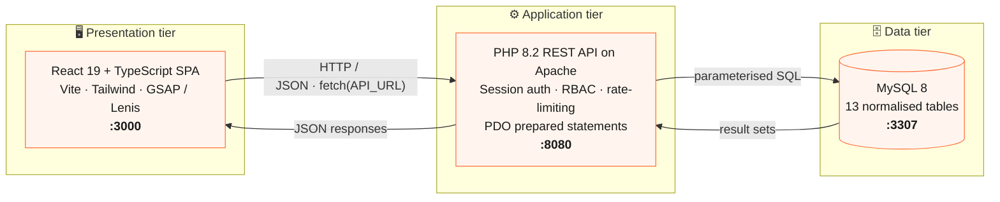

**How a booking flows through the tiers:**

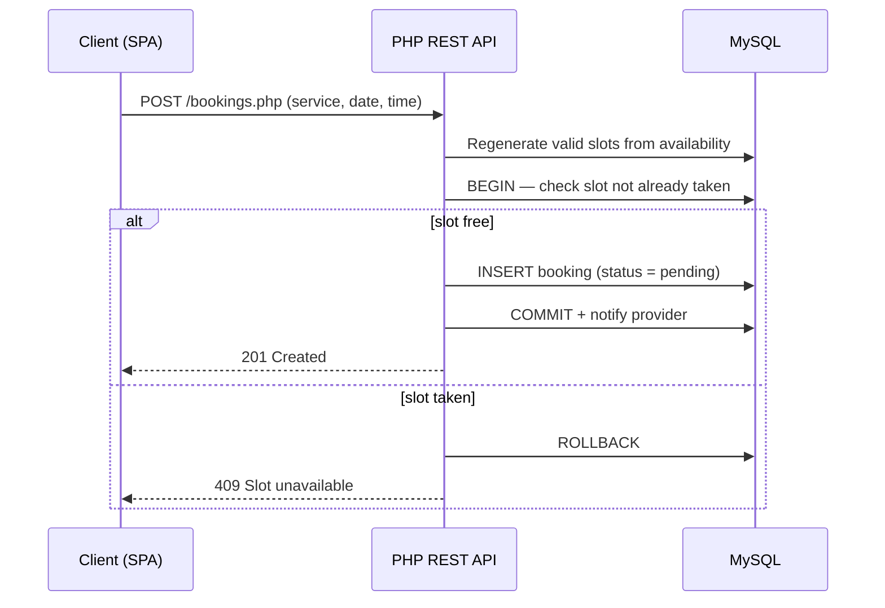

---

## 🧱 Tech Stack

| Layer | Technology |
|---|---|
| Frontend | React 19, TypeScript, Vite 7, Tailwind CSS 3, React Router 7, GSAP, Lenis, lucide-react |
| Backend | PHP 8.2 + Apache, PDO (prepared statements), session auth |
| Database | MySQL 8 |
| Tooling | Docker & Docker Compose |

---

## 📸 Screenshots

### Discovery & booking (client)

<table>
  <tr>
    <td width="50%">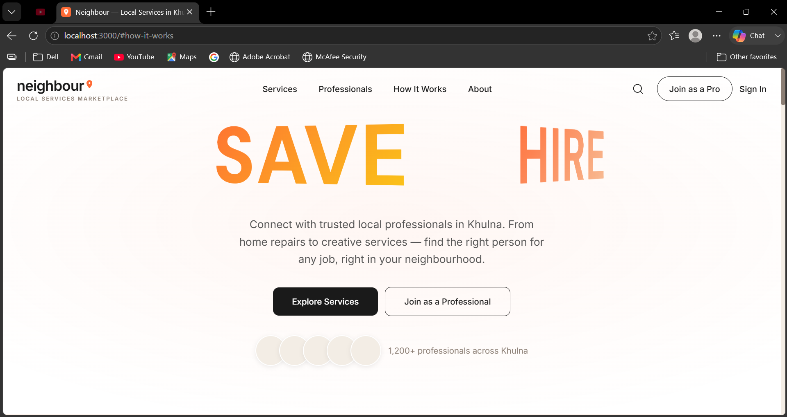<br/><sub><b>Landing / hero</b></sub></td>
    <td width="50%">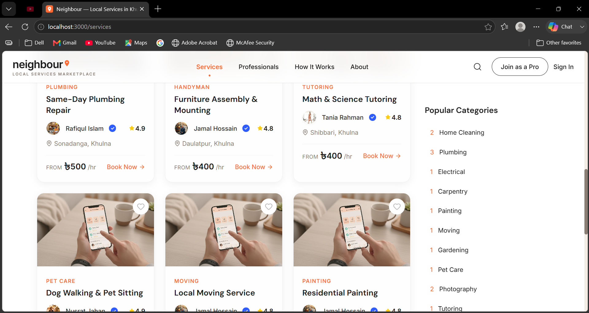<br/><sub><b>Services directory — search, filter & sort</b></sub></td>
  </tr>
  <tr>
    <td width="50%">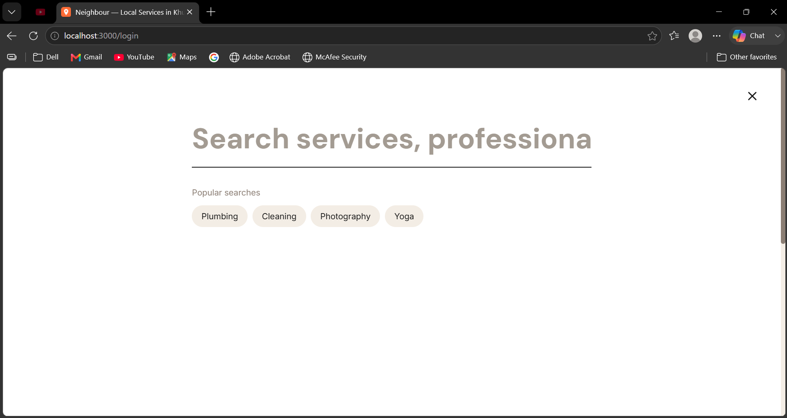<br/><sub><b>Global search overlay</b></sub></td>
    <td width="50%">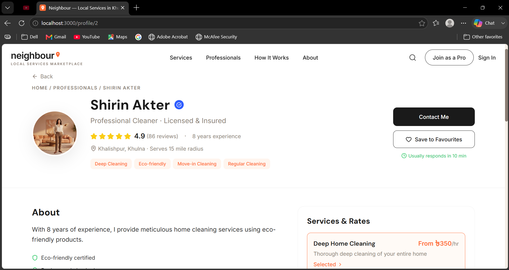<br/><sub><b>Professional profile</b></sub></td>
  </tr>
  <tr>
    <td width="50%">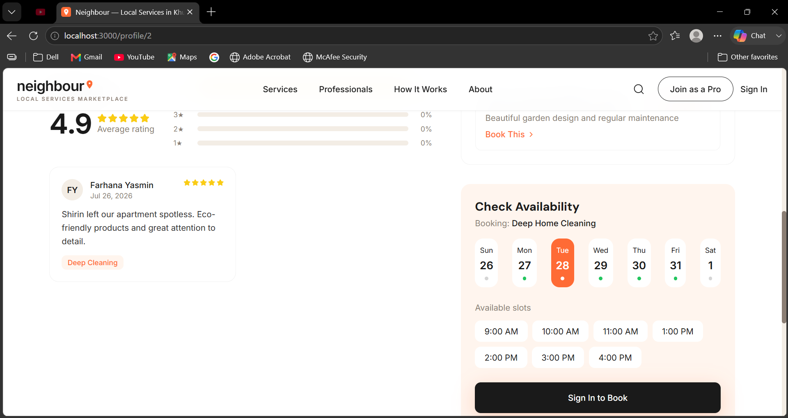<br/><sub><b>Booking a time slot</b></sub></td>
    <td width="50%">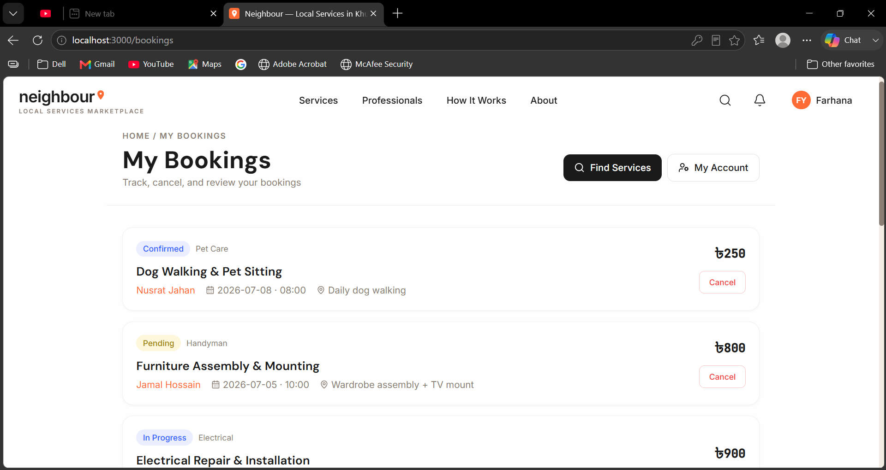<br/><sub><b>Client — My Bookings</b></sub></td>
  </tr>
  <tr>
    <td width="50%">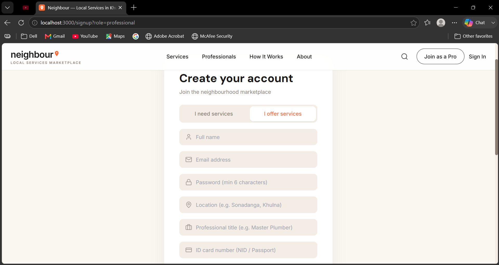<br/><sub><b>Provider sign-up (National ID)</b></sub></td>
    <td width="50%">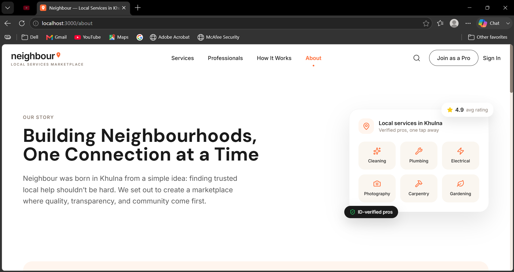<br/><sub><b>About page</b></sub></td>
  </tr>
</table>

### Service provider

<table>
  <tr>
    <td width="50%">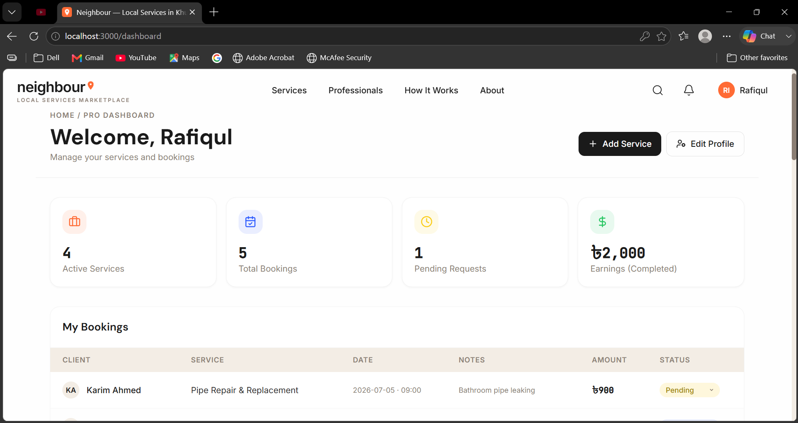<br/><sub><b>Provider dashboard — stats & bookings</b></sub></td>
    <td width="50%">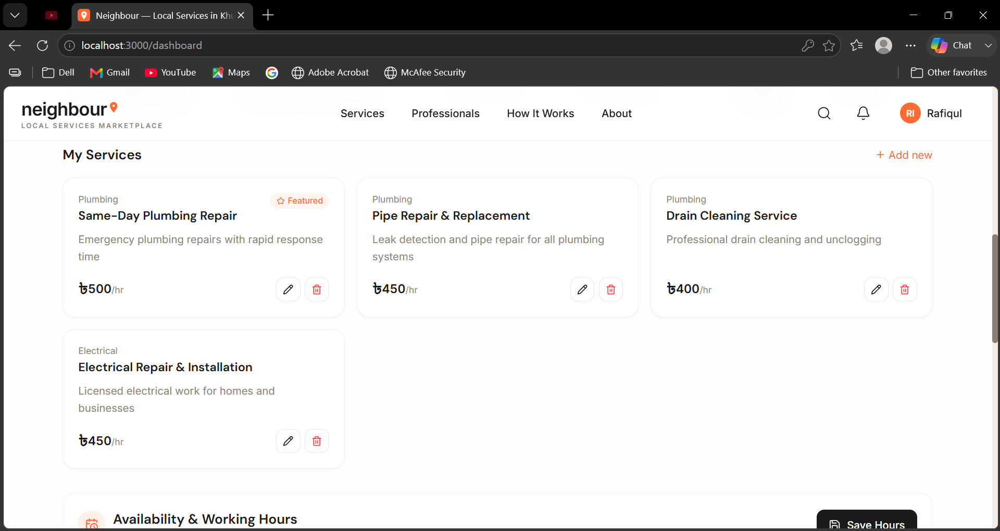<br/><sub><b>Service management</b></sub></td>
  </tr>
  <tr>
    <td width="50%">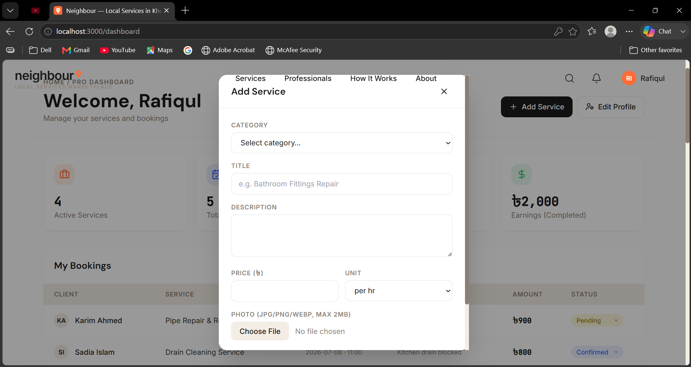<br/><sub><b>Add a service</b></sub></td>
    <td width="50%">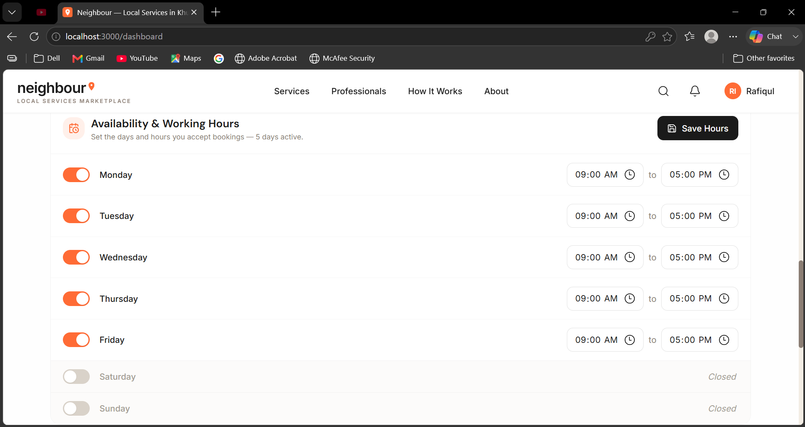<br/><sub><b>Weekly availability</b></sub></td>
  </tr>
</table>

### Administrator

<table>
  <tr>
    <td width="50%">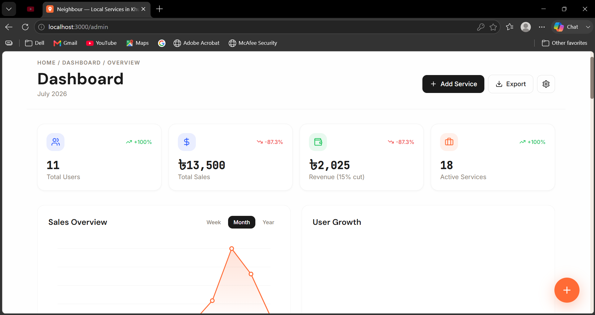<br/><sub><b>Admin dashboard</b></sub></td>
    <td width="50%">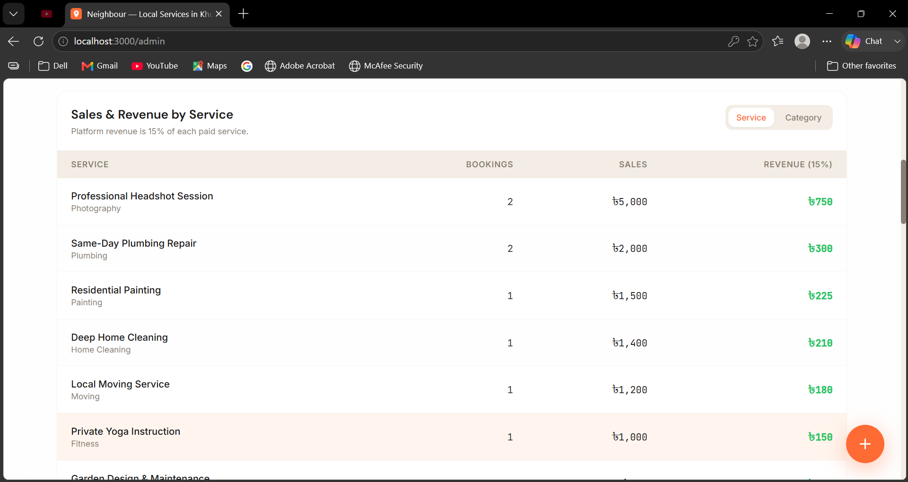<br/><sub><b>Sales & revenue breakdown</b></sub></td>
  </tr>
  <tr>
    <td width="50%">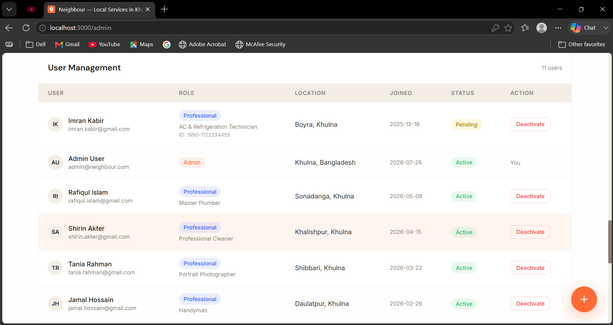<br/><sub><b>User & provider management</b></sub></td>
    <td width="50%">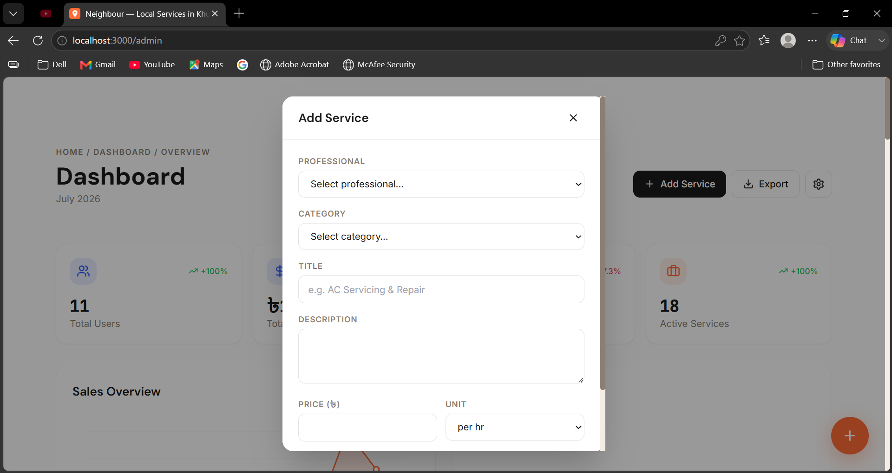<br/><sub><b>Add service (admin)</b></sub></td>
  </tr>
</table>

---

## 📁 Project Structure

```
Local Service Market/
├── app/                      # React + TypeScript frontend (Vite)
│   ├── src/
│   │   ├── components/       # Header, Footer, cards, UI primitives
│   │   ├── pages/            # Home, Services, Professionals, Profile,
│   │   │                     #   Dashboard, Admin, MyBookings, Messages,
│   │   │                     #   Favourites, Login, Signup, About …
│   │   ├── context/          # AuthContext (session/auth state)
│   │   ├── lib/api.ts        # Typed API client for the PHP backend
│   │   ├── data/             # Bundled demo data (offline fallback)
│   │   └── hooks/            # useLenis, useScrollAnimation, …
│   └── public/images/        # Static images (service & profile photos)
│
├── php-backend/              # PHP REST API
│   ├── api/                  # auth, users, professionals, services,
│   │                         #   bookings, reviews, availability, favorites,
│   │                         #   messages, notifications, stats, upload
│   ├── config/               # database.php (PDO + migrations), notify.php
│   ├── sql/
│   │   ├── schema.sql         # Schema + seed data (auto-runs on first DB start)
│   │   ├── demo-provider-emails.sql   # Optional: refresh demo provider logins
│   │   └── demo-provider-photos.sql   # Optional: set demo provider photos
│   ├── uploads/              # Runtime image uploads (git-ignored)
│   ├── setup.php             # One-time setup wizard (XAMPP mode)
│   └── Dockerfile
│
├── docs/                     # ER diagram, use-case diagram, screenshots
│   └── Screenshot/           # UI screenshots used in this README
├── docker-compose.yml        # One-command local stack (db + backend + frontend)
├── .gitignore
└── README.md                 # ← single source of truth (you are here)
```

---

## 🚀 Getting Started

You can run the whole project **two ways**. Docker is recommended — it needs no XAMPP, no manual database setup, and works the same on any machine.

### ✅ Prerequisites

- **Option A (Docker):** [Docker Desktop](https://www.docker.com/products/docker-desktop/) installed and **running**.
- **Option B (Manual):** [XAMPP](https://www.apachefriends.org/) (Apache + MySQL + PHP 8) and [Node.js 20+](https://nodejs.org/).

Clone the repository first:

```bash
git clone <your-repo-url>
cd "Local Service Market"
```

### Option A — Run with Docker (recommended) 🐳

From the project root:

```bash
docker compose up --build
```

That's it. On the first start it builds the images, installs frontend dependencies, and **auto-creates the database, tables and seed data**.

| Service | URL |
|---|---|
| **Frontend** | http://localhost:3000 |
| **Backend API** | http://localhost:8080/neighbour/api |
| **MySQL** | localhost:3307 (user `root`, no password) |

Ports **8080 / 3307** are used so a running XAMPP (80 / 3306) won't clash.

**Common commands:**

```bash
docker compose up --build          # start (rebuild images)
docker compose up -d               # start in the background
docker compose down                # stop (keep the database)
docker compose down -v             # stop AND wipe the database (fresh re-seed next start)
docker compose restart frontend    # restart just the frontend
docker compose exec frontend npm run build   # verify a clean production build
```

> Hot-reload works out of the box (Vite file-watching is configured with polling for Docker on Windows/WSL2). Edit any file under `app/` and the browser updates automatically. PHP changes under `php-backend/` are live-mounted too — no rebuild needed.

### Option B — Run without Docker (XAMPP + Node) 🧰

**1. Backend (XAMPP)**
1. Copy the contents of `php-backend/` into `C:\xampp\htdocs\neighbour\`
2. Start **Apache** and **MySQL** in the XAMPP control panel
3. Open **http://localhost/neighbour/setup.php** — this creates the database, tables, seed data and demo passwords

**2. Frontend (Node)**
```bash
cd app
npm install
npm run dev
```
Open **http://localhost:5173**. The frontend talks to `http://localhost/neighbour/api` by default (see `app/.env.example` to override).

> If the backend isn't running, the site still works using bundled demo data (an orange "demo data" badge is shown).

---

## 🔑 Demo Accounts

| Role | Email | Password |
|---|---|---|
| **Admin** | admin@neighbour.com | admin123 |
| **Client** | farhana@example.com | client123 |

**Service providers** (all share the password `pro123`):

| Name | Email | Status |
|---|---|---|
| Rafiqul Islam — Plumber | rafiqul.islam@gmail.com | approved |
| Shirin Akter — Cleaner | shirin.akter@gmail.com | approved |
| Tania Rahman — Photographer | tania.rahman@gmail.com | approved |
| Jamal Hossain — Handyman | jamal.hossain@gmail.com | approved |
| Nusrat Jahan — Yoga Instructor | nusrat.jahan@gmail.com | approved |
| Imran Kabir — AC Technician | imran.kabir@gmail.com | **pending** (approve via admin first) |

Extra demo clients (password `client123`): `karim.ahmed@gmail.com`, `sadia.islam@gmail.com`, `nayeem.hasan@gmail.com`.

**Try the full flow:** log in as a client → book a provider's service → log out → log in as that provider → see the booking on their dashboard → Confirm / Complete it → log in as admin to watch sales & revenue update.

---

## 🗃️ Data Model

The database is a normalised MySQL schema of **13 tables**. Every user (client, provider or admin) lives in a single `users` table distinguished by a `role`; providers are extended one-to-one by `professional_profiles`. Reviews are bound one-to-one to a completed booking so only genuine customers can rate a provider.

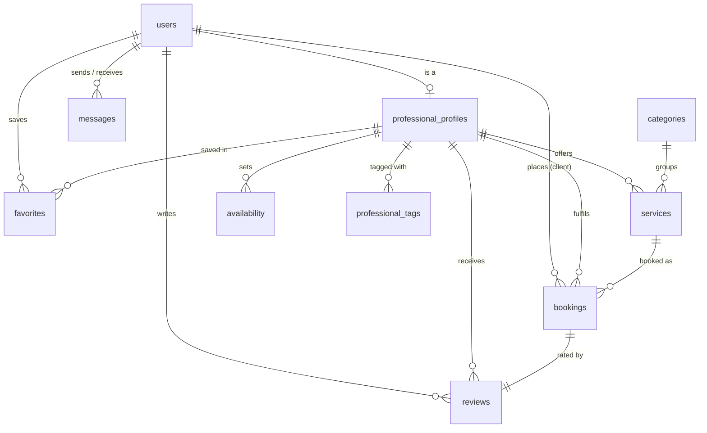

| Table | Purpose |
|---|---|
| `users` | Accounts for clients, providers and admins; role, approval status, contact & location |
| `professional_profiles` | Extended provider info: title, bio, experience, rating, review count |
| `categories` | Service categories (Plumbing, Cleaning, …) for classification & filtering |
| `services` | Individual services offered by a provider, with price, price unit and image |
| `bookings` | A client's booking of a service — date, time, status, amount, payment status |
| `reviews` | One-to-one review of a completed booking; drives the provider's aggregate rating |
| `availability` | Per-day working hours that generate the client-facing booking slots |
| `favorites` | Saved providers per client |
| `messages` | In-app client ↔ provider chat |
| `notifications` | Event notifications (bookings, status changes, approvals) |
| `professional_tags` | Free-form skill tags on a provider profile |
| `login_attempts`, `password_resets` | Support tables for rate-limiting and password recovery |

> The full schema (with seed data) lives in [`php-backend/sql/schema.sql`](./php-backend/sql/schema.sql). Design artifacts (ER diagram, use-case diagram) are in [`docs/`](./docs).

---

## 🔌 API Reference

Base URL: `http://localhost:8080/neighbour/api` (Docker) or `http://localhost/neighbour/api` (XAMPP). All write operations are authorised on the server by role; responses are JSON.

### Authentication
| Method | Endpoint | Description |
|---|---|---|
| POST | `/auth.php?action=register` | Register a new user |
| POST | `/auth.php?action=login` | Log in |
| POST | `/auth.php?action=logout` | Log out |
| GET | `/auth.php?action=verify` | Verify the current session |

### Services
| Method | Endpoint | Description |
|---|---|---|
| GET | `/services.php` | List services (paginated) |
| GET | `/services.php?id=1` | Get a single service |
| GET | `/services.php?featured=1` | Featured services |
| GET | `/services.php?category=plumbing` | Filter by category slug |
| GET | `/services.php?mine=1` | Logged-in provider's own services |
| POST | `/services.php` | Create a service |
| PUT | `/services.php?id=1` | Update a service |
| DELETE | `/services.php?id=1` | Soft-delete a service |

### Professionals
| Method | Endpoint | Description |
|---|---|---|
| GET | `/professionals.php` | List professionals |
| GET | `/professionals.php?id=1` | Professional details (services + reviews) |
| GET | `/professionals.php?top=1` | Top professionals |
| GET | `/professionals.php?search=plumber` | Search |

### Bookings
| Method | Endpoint | Description |
|---|---|---|
| GET | `/bookings.php` | List bookings for the current user/role |
| POST | `/bookings.php` | Create a booking (double-booking safe) |
| PUT | `/bookings.php?id=1&status=confirmed` | Advance booking status |

### Other resources
| Method | Endpoint | Description |
|---|---|---|
| GET | `/categories.php` | List categories |
| GET/POST | `/reviews.php` | Submit / fetch reviews for completed bookings |
| GET/POST | `/availability.php` | Per-provider weekly availability |
| GET/POST/DELETE | `/favorites.php` | Saved providers |
| GET/POST | `/messages.php` | In-app messaging |
| GET | `/notifications.php` | User notifications |
| GET | `/stats.php` | Aggregated admin sales / revenue / growth |
| POST | `/upload.php` | Validated image upload |

---

## 🗄️ Database Notes

- On Docker, `php-backend/sql/schema.sql` runs automatically the **first** time the database volume is created. To re-seed from scratch, run `docker compose down -v` then `docker compose up`.
- The app also self-heals: newer columns/tables are added automatically at runtime (see `config/database.php`), so existing databases keep working.
- Optional helper scripts (run without a full reset):
  ```bash
  # refresh demo provider emails/passwords
  docker compose exec -T db mysql -uroot neighbour_db < php-backend/sql/demo-provider-emails.sql
  # set demo provider profile photos
  docker compose exec -T db mysql -uroot neighbour_db < php-backend/sql/demo-provider-photos.sql
  ```

---

## 🧯 Troubleshooting

| Problem | Fix |
|---|---|
| `failed to connect to the docker API … daemon is running` | Start **Docker Desktop** and wait for "Engine running", then retry. |
| `ports are not available … socket … forbidden` (Windows) | Port 8080 is reserved by Windows/Hyper-V (WinNAT). In an **Administrator** terminal: `net stop winnat` → `cd` to the project → `docker compose up -d` → `net start winnat`. Or change the `8080` mapping in `docker-compose.yml` (and `VITE_API_URL`) to a free port. |
| Edits don't show in the browser | `docker compose restart frontend`, then hard-refresh (Ctrl+Shift+R). |
| `'tsc' is not recognized` when building on the host | Run the build inside the container: `docker compose exec frontend npm run build`. |
| Docker won't start on Windows | Update WSL: `wsl --update`, then restart Docker Desktop. |
| Ports already in use | Stop whatever uses 3000 / 8080 / 3307, or change the port mappings in `docker-compose.yml`. |

---

## 🗺️ Roadmap / Future Work

- Online payment gateway (bKash / SSLCommerz / Stripe) — payments are currently modelled but not charged
- Email / SMS notifications (currently in-app only)
- Geolocation-based search (schema already stores lat/long)
- Native mobile app
- Automated testing + CI pipeline

---

## Author
- Github
- Linkedin
- Medium
